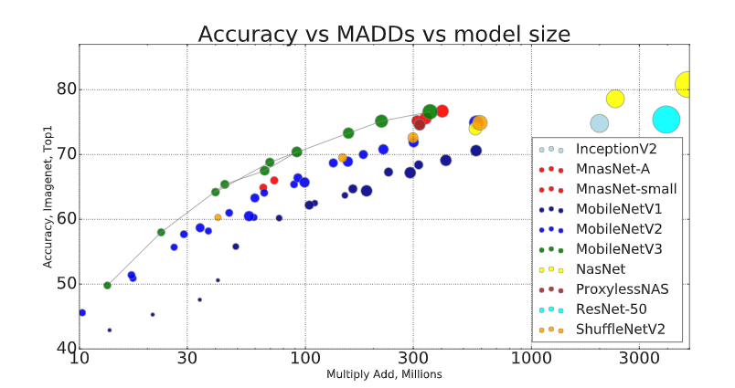

# MobileNetV3

This folder contains building code for
[MobilenetV3](https://arxiv.org/abs/1905.02244) networks. [PR to Keras](https://github.com/keras-team/keras-applications/pull/176).

## Performance

### Mobilenet V3 latency

This is the timing of [MobileNetV2] vs [MobileNetV3] using TF-Lite on the large
core of Pixel 1 phone.

### MACs

MACs, also sometimes known as MADDs - the number of multiply-accumulates needed
to compute an inference on a single image is a common metric to measure the
efficiency of the model. Full size Mobilenet V3 on image size 224 uses ~215
Million MADDs (MMadds) while achieving accuracy 75.1%, while Mobilenet V2 uses
~300MMadds and achieving accuracy 72%. By comparison ResNet-50 uses
approximately 3500 MMAdds while achieving 76% accuracy.

Below is the graph comparing Mobilenets and a few selected networks. The size of
each blob represents the number of parameters.

## Pretrained models

### Mobilenet V3 Imagenet Checkpoints

All mobilenet V3 checkpoints were trained with image resolution 224x224. All
phone latencies are in milliseconds, measured on large core. In addition to
large and small models this page also contains so-called minimalistic models,
these models have the same per-layer dimensions characteristic as MobilenetV3
however, they don't utilize any of the advanced blocks (squeeze-and-excite
units, hard-swish, and 5x5 convolutions). While these models are less efficient
on CPU, they are much more performant on GPU/DSP.

| Imagenet Checkpoint | MACs (M) | Params (M) | Top1 | Pixel 1 | Pixel 2 | Pixel 3 |
| ------------------ | -------- | ---------- | ---- | ------- | ------- | ------- |
| [Large dm=1 (float)]   | 217      | 5.4        | 75.2 | 51.2    | 61      | 44      |
| [Large dm=0.75 (float)] | 155      | 4.0        | 73.3 | 39.8    | 48      | 34      |
| [Small dm=1 (float)]   | 66       | 2.9        | 67.5 | 15.8    | 19.4    | 14.4    |
| [Small dm=0.75 (float)] | 44       | 2.4        | 65.4 | 12.8    | 15.9    | 11.6    |

#### Minimalistic checkpoints:

| Imagenet Checkpoint | MACs (M) | Params (M) | Top1 | Pixel 1 | Pixel 2 | Pixel 3 |
| -------------- | -------- | ---------- | ---- | ------- | ------- | ------- |
| [Large minimalistic (float)]   | 209      | 3.9        | 72.3 | 44.1    | 51      | 35      |
| [Small minimalistic (float)]   | 65       | 2.0        | 61.9 | 12.2    | 15.1    | 11      |

[Small minimalistic (float)]: https://storage.googleapis.com/mobilenet_v3/checkpoints/v3-small-minimalistic_224_1.0_float.tgz
[Large minimalistic (float)]: https://storage.googleapis.com/mobilenet_v3/checkpoints/v3-large-minimalistic_224_1.0_float.tgz
[Large dm=1 (float)]: https://storage.googleapis.com/mobilenet_v3/checkpoints/v3-large_224_1.0_float.tgz
[Small dm=1 (float)]: https://storage.googleapis.com/mobilenet_v3/checkpoints/v3-small_224_1.0_float.tgz
[Large dm=0.75 (float)]: https://storage.googleapis.com/mobilenet_v3/checkpoints/v3-large_224_0.75_float.tgz
[Small dm=0.75 (float)]: https://storage.googleapis.com/mobilenet_v3/checkpoints/v3-small_224_0.75_float.tgz
